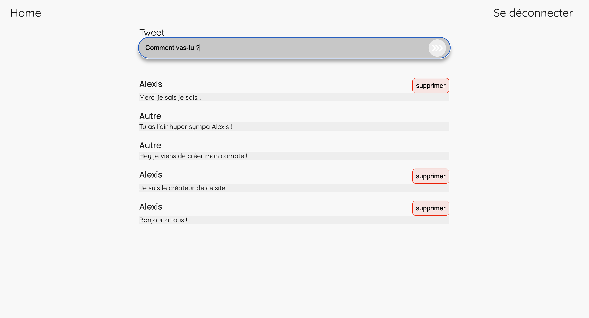
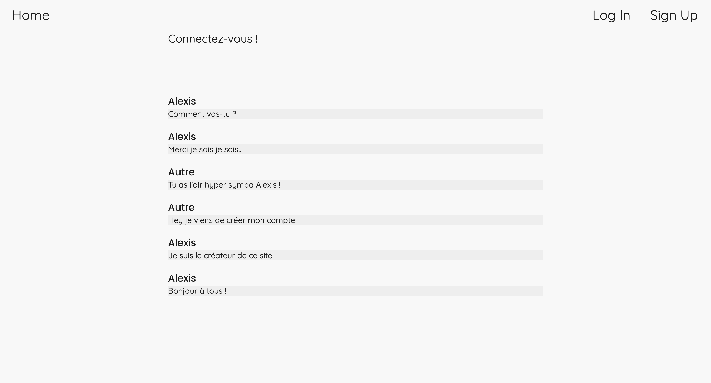
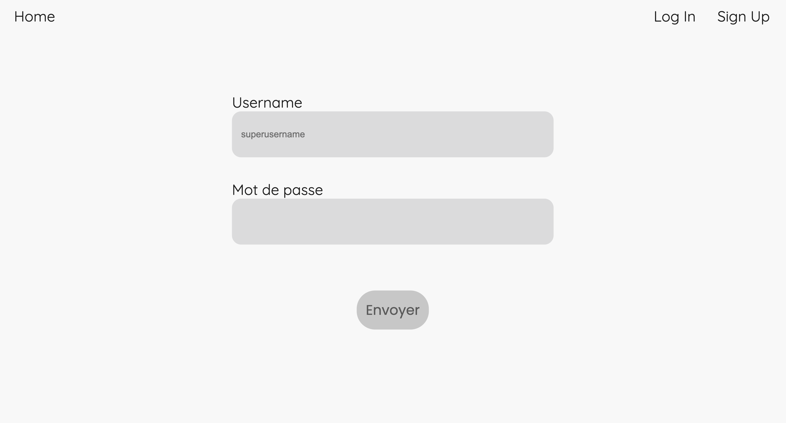
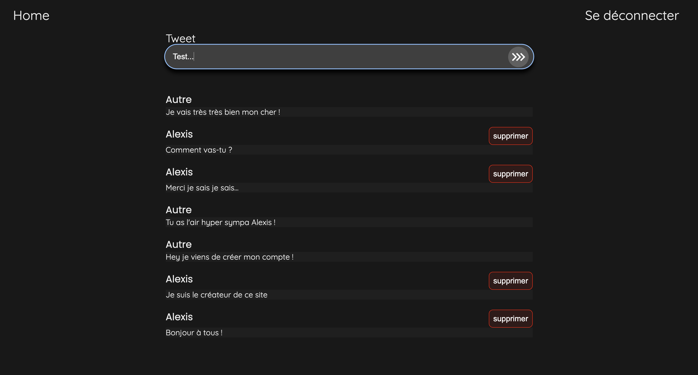

# Tweeter

## Overview

Tweeter is a social network platform that allows users to create an account and engage in real-time discussions within a global feed shared by all users.

## Running the Project

To run the application, simply execute the following command, ensuring that Docker is correctly installed and configured on your machine, and that you are in the root directory of the project:
```bash
docker compose up --build
```
And that's it! Visit `http://localhost:5173/` to see the site in action.

> *Note: You can add a `api/.env` file and define `MONGODB_ADDRESS` (default: `mongodb://mongo:27017/tweeter`) if you wish to use a MongoDB Atlas Cluster.

Also, define `TOKEN` to override the authentication tokens used by the application.  
The `PORT` variable can also be defined in this file, but it is not recommended to use a port other than 3001, as networking is managed by Docker in this setup.*

You can find more detailed information in the other `README.md` files located in the [`api`](api/README.md), [`native`](native/README.md), and [`web`](web/README.md) directories.

## Examples

>   
> *The main page when logged in*

>   
> *The main page when not logged in*

>   
> *The input fields for logging in or creating an account*

>   
> *A preview of dark mode on the main page*
